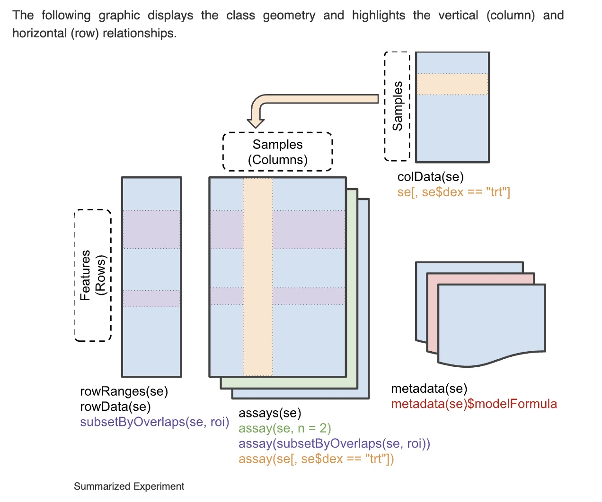

```{r setup,echo=FALSE,results="hide",message=FALSE}
library(BiocNIHIntra)
library(DT)
```

# Introduction

This vignette provides a very brief introduction to
the use of Bioconductor packages and functions to
work with single cell RNA-seq data.  The tasks include

- learning about SummarizedExperiment to manage multiple samples
constituting reference expression data on selected cell types
- learning about SingleCellExperiment to work with expression
patterns on thousands of cells
- using the SingleR package and function to train a 
classifier of cell types and label a sample of PBMCs
assayed with TENx
- projecting expression patterns for visualization using approximate PCA
- using plotly to visualize clusters with labels

# Data acquisition

## Microarray-derived reference

We'll be working with the data from the publication


The workflow for producing a reference resource is:


### Data structure to be used

The following schematic is from the `r Biocpkg("SummarizedExperiment")` vignette.



Briefly, a SummarizedExperiment can be treated like a matrix.  `dim(SE)` evaluates
to a 2-vector with first element the number of genomic features assayed and
second element the number of samples or cells assayed.  The syntax
`SE[r,c]` evaluates to a new SummarizedExperiment with rows and columns subset
by the predicates `r`, `c`.  The `assay` component has rows corresponding to genomic features 
and columns corresponding to samples or single cells.  The `colData` component manages
a table of information about samples or cells.  The `rowData` component manages
information about genomic features assayed.

### The HPCA SummarizedExperiment

```{r do1,message=FALSE}
library(BiocNIHIntra)
hd = getHPCAreference()
hd
```

This representation of the HPCA reference has been preprocessed;
the paper noted in the help text from `?HumanPrimaryCellAtlasData` with
the `r Biocpkg("celldex")` package attached gives details.

The collection of cell types available can be seen with
```{r getdatt}
library(DT)
datatable(as.data.frame(colData(hd)))
```

## The TENx PBMC data

This dataset uses a specialized container called SingleCellExperiment;
see the `r Biocpkg("SingleCellExperiment")` vignette for further details.
The schematic is:


We retrieve the data:
```{r do2,message=FALSE}
vps = get4kPBMC()
vps
```

A nice feature of the Bioconductor approach to dealing with
single cell data in SingleCellExperiment is that we can
quickly get a display after dimension reduction:
```{r lkpc}
vps = runPCA(vps)
plotPCA(vps)
```
We don't know the basis of the clustering structure in this
display.  Perhaps it relates to cell type.

# Cell labeling

Now we use the SingleR algorithm with all defaults
(see ?SingleR for details) to obtain labels by
comparing expression patterns between the PBMC
data and the reference.

```{r dolabs,cache=TRUE}
library(SingleR)
vsing = SingleR(vps, hd, hd$label.main)
vps$label.main = vsing$labels
table(vps$label.main)
```

# Feature reduction and interactive visualization

We'll conclude by developing an interactive biplot
that shows both the projection to principal components
(with a reduced set of genes) and a representation
of gene "loadings", showing contributions of specific
genes to the positioning
of cells in the principal components projection.

## Filter on SD across cells

First we filter to genes with substantial variation
across cells -- we take the top 20% in the
distribution of standard deviations.
This produces a SingleCellExperiment `vpslim`.

```{r trim}
vpssds = rowSds(assay(vps))
kp = which(vpssds > quantile(vpssds, .8))
vpslim = vps[kp,]
```

## Compute approximate PCA
Then we prepare a specific representation
of principal components analysis using the
`r CRANpkg("irlba")` procedure for
approximate PCA.

```{r lksir}
set.seed(1234)
mat = t(as.matrix(assay(vpslim,2)))
library(irlba)
apca = prcomp_irlba(mat, 4)
names(apca)
summary(apca)
```

## Produce interactive biplot

```{r dofilt}
npl = filtered_biplot(apca, vpslim, nvar=10)
library(plotly)
ggplotly(npl)
```
